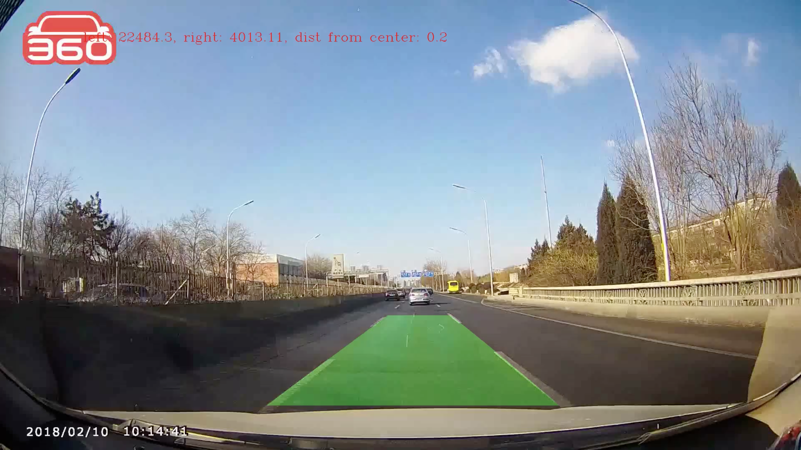
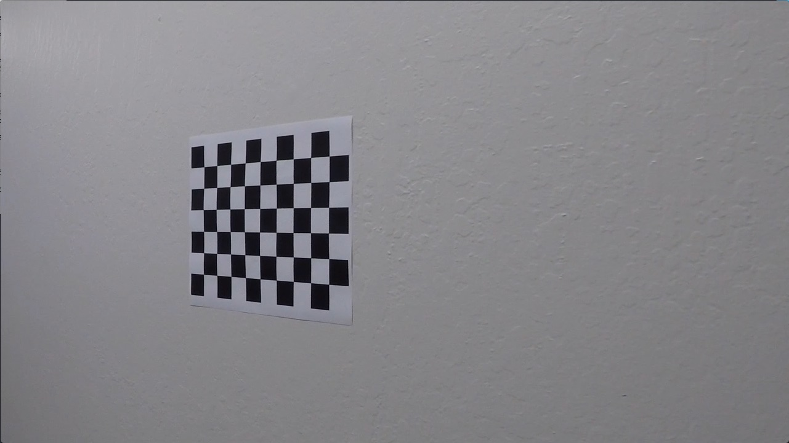
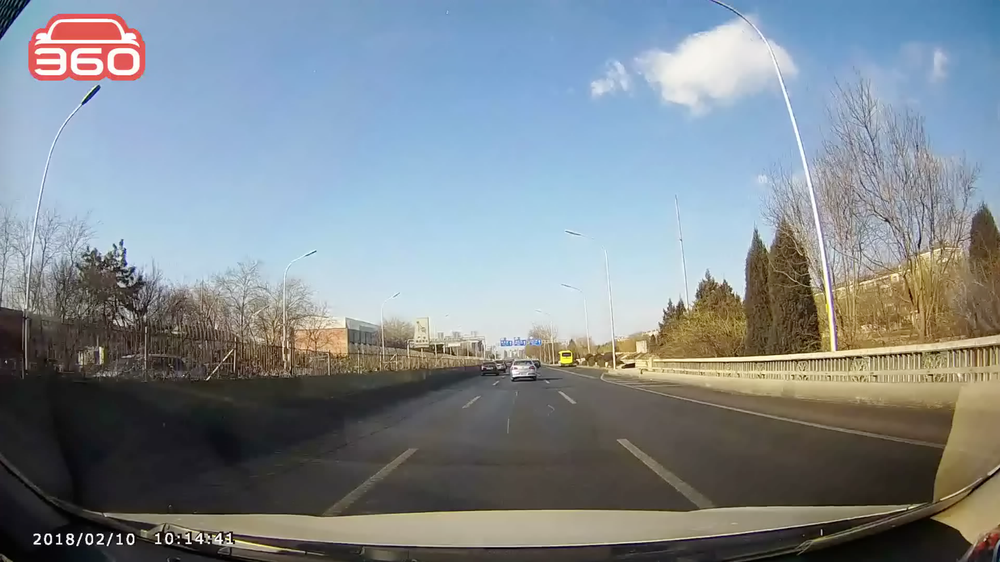
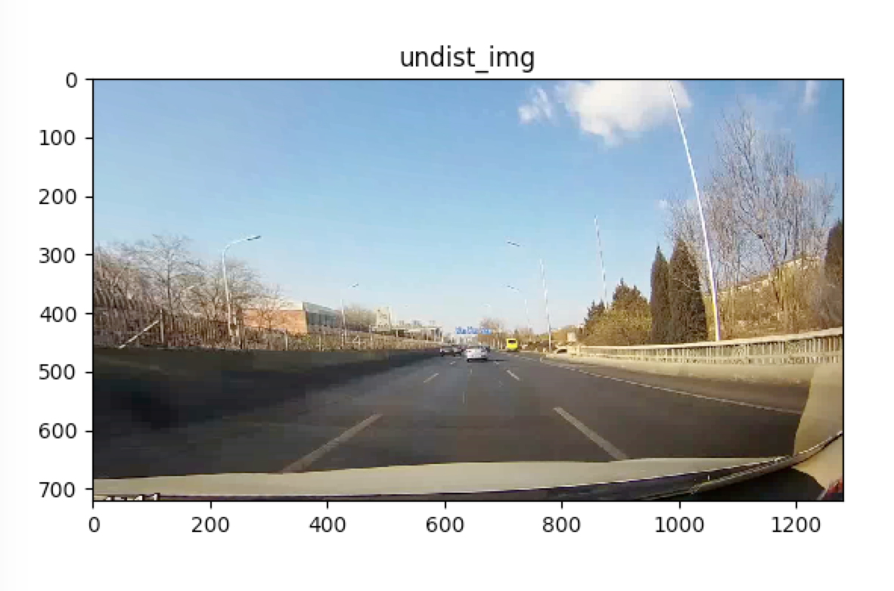
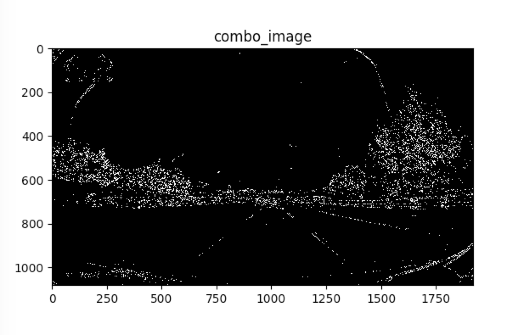
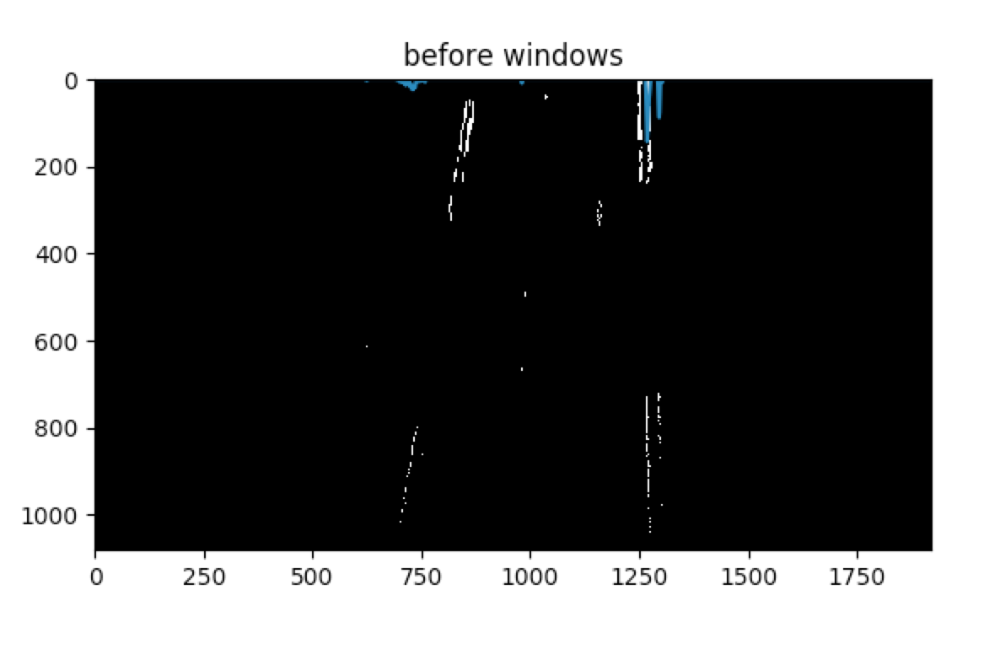
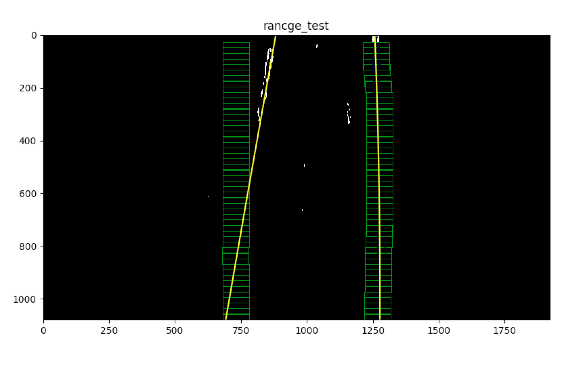

# lane-area-detection

## 简介
本项目通过分析检测视频中每一帧的车道线，检测车道临近区域并做相应标记，再转换为视频输出。

运行步骤：

1. 标定相机,获得相机内参
2. 矫正图像曲度
3. 车道线二值提取
4. 转换鹰眼视图
5. 检测左右车道，并拟合出车道曲线
6. 更新车道区域，并转换回原始视图

## 详细介绍

### 标定相机

**calibrate_camera.py**:
使用OpenCV相机标定函数, 从不同的角度和距离对标定棋盘进行标定。calibrate_cam()函数会寻找棋盘图像的内角.
棋盘图例如下：

### 矫正图像

计算得到的相机内参可以用于矫正视频图像，修正由于相机广角造成的图像畸变。undist()用于对视频帧的图像处理工作。
处理前图像：

处理后图像：

可以观察到，图像边缘部分被修正了，为接下来的视图变换奠定了基础。

### 车道线提取

使用灰度二值进行提取。

threshold_helpers.py 包含了多种opencv的二值提取方法，其中包括：

1. abs_sobel_thresh(): 沿x轴或y轴, 在给定灰度阀值和过滤器(kernel)大小情况下, 进行边缘检测，形成二值图像。
2. hls_thresh(): 使用hls(色相，亮度，饱和度)色谱的饱和度通道作为二进制阀值, 形成二值图像。
3. hsv_thresh(): 使用hsv(色相，饱和度，明度)色谱的明度通道作为二进制阀值，形成二值图像。
4. mag_thresh(): 混合了x轴和y轴的abs_sobel_thresh方案，根据两个方向的二范数决定二值图像。
5. dir_thresh(): 使用0 (竖直方向)到pi/2 (水平方向)做为阀值的abs_sobel_thresh方案。
6. combo_thresh(): 组合函数，用于组合上诉几种二值算法。

通过组合观察，最终发现fls和hsv的组合或abs_sobel_thresh的x轴、y轴组合为组合中最佳的分类算法。

调试图像如下：

draw_lane.py 包含了鹰眼视图的转换、车道曲线拟合、拟合区域合并等主要方法。

### 鹰眼视图转换

change_perspective(): 将二值图像进行ROI分割，此步骤不仅可以提高计算效率，也可以减少对路面车道线的检测误差。
分割区域为鹰眼视图的映射区域，该区域通过人工设定4个点为边界, 自动计算出图像ROI的上下边界高度以及宽度。
使用cv2.getPerspectiveTransform获得转换模型，然后通过cv2.warpPerspective转换成鹰眼视图。

视图转换后的图像，左右车道应该是平行显示的，这样为拟合车道曲线创造了条件。

### 车道曲线拟合

lr_curvature(): 首先将二值图像沿x轴对y轴像素求和，找出左右求和峰值，此处为检测出的车道线位置，接下来通过
滑动窗口动态寻找车道像素，最终将采样点拟合到二阶多项式，再计算二项式的曲率半径，形成车道曲线。

由于车道线连续性的特点，滑动窗口的位移计算采用了指数加权平均(EWA)算法，设定dacay_rate为0.8
这样即使某一帧的滑动窗口计算误差比较大，也会根据相关联帧的计算来适当修正结果。

示例如下：滑动窗口（绿），对应左侧（红）和右侧（蓝）像素以及最佳的拟合曲线（黄）

### 拟合区域合并

draw_on_road(): 将获得的左右车道区域最佳拟合线，填充为绿色。然后再将原始鹰眼视图反向变换成原始图像之中。

最终效果图为：

## 讨论
1. 对于不太清晰车道线的二项式拟合，容易出现拟合漂移情况，这种情况打算考虑前期处理的结果，因为车道线的方向是连续的。
需要加入优化方法和检测方法，通过阀值方式缓存最优的车道线。
2. 对于车道线检测，可以使用CNN方式来获取，这样鲁棒性可能更强，需要尝试相关方案。
3. 相机校准很重要，如果校准后图像出现畸变，需要重新校准后再进行车道检测。

## 感谢
本文是通过学习Udacity无人驾驶课程的知识来创作的，因此对无人驾驶的视觉处理有了一些了解，非常感谢Udacity提供这样的途径和入门方式，
同时希望可以在无人驾驶事业的路上继续成长，成为真正的无人驾驶技术人才。